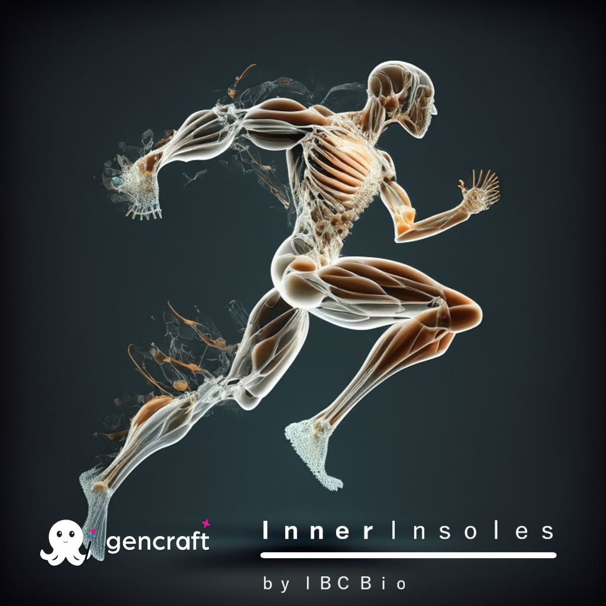

# Proyecto Prototipo InnerInsoles
# IBC Bio :registered: 2023


  

## Configuraciones

### Inicio de la base de datos (problema si no se añaden o recuperan Pacientes)
- Se recomienda Clean+Build
- Borrar las carpetas bin/ y obj/
- 
**Dentro de la carpeta insoles/**

- Añadir el paquete dotnet-ef en la .NET Cli:

```cmd
dotnet tool install --global dotnet-ef
```
- Ejecutar la creación inicial de la bd y actualizar (.Net CLI)
```cmd
dotnet ef migrations add InitialCreate
dotnet ef database update
```

# Flows
## Tabs